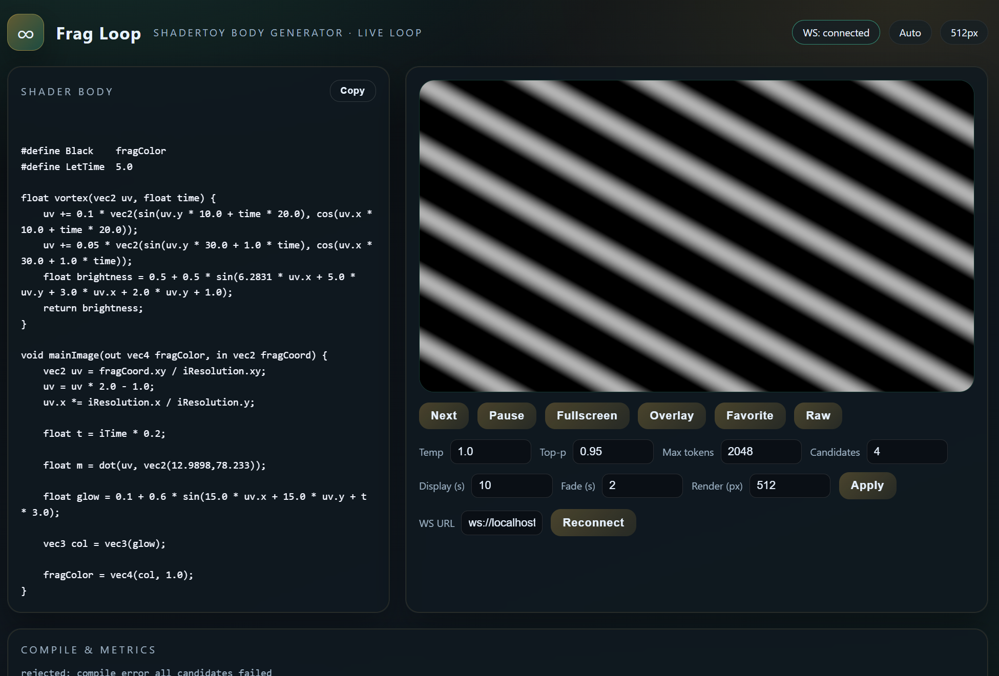

# Frag Loop

Frag Loop is a local demo runtime where a scratch-trained SLM (Small Language Model) generates all shader code, continuously producing Shadertoy-compatible GLSL fragment **shader bodies**, compiling them in WebGL2, and crossfading the results in a browser UI. This `publish/` bundle is focused on **running** trained models (not training).

## Screenshot



Limitation: Currently there is little diversity, and it frequently generates code that fails to compile.

## Model Architecture

Frag Loop uses a decoder-only Transformer (GPT-style) trained from scratch to generate **Shadertoy-compatible GLSL fragment shader bodies**. The model outputs the body only (functions + `mainImage`) and is wrapped by a fixed WebGL2/Shadertoy template at runtime.

Pretrained model: https://huggingface.co/hanasaan/frag-loop

## What the model was trained on (summary)
- **Pretrain**: GLSL-heavy subset from **The Stack (bigcode/the-stack-dedup)**.
- **SFT**: **Vipitis/Shadereval-inputs** (Shadertoy-oriented subset).

Both datasets include mixed licenses; provenance and licensing should be respected if you redistribute outputs or data.

---

## Acknowledgements

- The tokenizer implementation is heavily influenced by **nanochat** (https://github.com/karpathy/nanochat).
- All implementation work in this repository was done by **GPT-5.2-Codex (xhigh)**.

---

## Quickstart (Inference + WebUI)

### 1) Install deps

```bash
cd publish
python -m venv .venv
# Windows
.venv\Scripts\activate
# macOS/Linux
source .venv/bin/activate

pip install -r requirements.txt
```

> Install an appropriate PyTorch build for your GPU (CUDA) or Apple Silicon (MPS) if needed.

---

### 2) Start the Python inference server (WebSocket)

This will download the model from Hugging Face and **auto-detect** the checkpoint/tokenizer files:

```bash
python infer/inference_server.py \
  --hf-repo hanasaan/frag-loop
```

If the repo has multiple checkpoints/tokenizers, specify them explicitly:

```bash
python infer/inference_server.py \
  --hf-repo hanasaan/frag-loop \
  --hf-ckpt ckpt_2000.pt \
  --hf-tokenizer tokenizer
```

You can also run from local files (no download):

```bash
python infer/inference_server.py \
  --ckpt path/to/ckpt_2000.pt \
  --tokenizer path/to/tokenizer
```

---

### 3) Start the UI server

```bash
node ui_optional/server_node/server.js
```

Open `http://localhost:5173` in your browser. The UI connects to `ws://localhost:8765/ws` by default. You can change the WS URL in the UI to point to another machine.

---

## Raw Mode / Failure Display

Toggle **Raw** in the UI to show outputs even if compilation fails or a copy is suspected:
- **Compile Error** → big red overlay + shader compile log
- **Copy Detected** → big red overlay

---

## Notes / Troubleshooting

- The inference server evaluates shaders via `moderngl`. If your machine cannot create a GL context, use `--raw-mode` to bypass rejection and still see results.
- Outputs and previews are saved under `publish/runs/YYYYMMDD/`.

---

## Optional: CLI generation (no UI)

```bash
python infer/generate.py \
  --ckpt path/to/ckpt_2000.pt \
  --tokenizer path/to/tokenizer \
  --max-new 512
```

---

## License / Attribution

If you plan to publish outputs, review the licensing and provenance requirements of The Stack and Shadereval-inputs.
